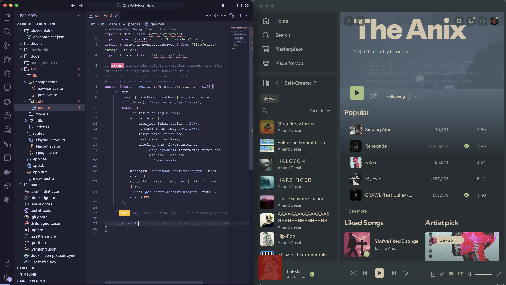
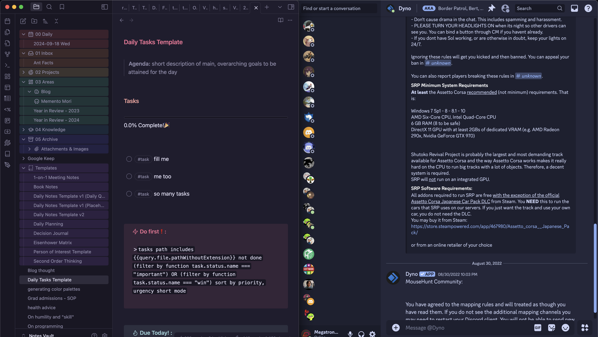

# dotfiles

[](#installation)
[](#system)
[](#system)
[](#system)
[](#system)
[](#system)
[](#dotfiles-setup---bare-git-repository)

[](https://visitorbadge.io/status?path=https%3A%2F%2Fgithub.com%2Fdesaianand1%2Fdotfiles%2F)
[](https://github.com/desaianand1/dotfiles)

Miscellaneous .dotfiles and setup automation to get a new macOS machine up and running with minimal effort.

## Overview


### System

- 💻 Terminal: kitty
- 🐚 Shell: zsh (w/ zgenom for some plugin management)
- ✍️ Font: JetBrains Nerd Font Mono (primarily; Fira Code Mono, Mononoki among others)
- 📝 Code Editor: Neovim or VSCode
- 📝 Note Editor: Obsidian, rarely Typora
- 💬 Prompt: p10k
- 🪟 Window Manager: xQuartz + Rectangle

### 🎨 Themes

|  |  |  |
|:----------------------------------------------------------------------:|------------------------------------------------------------------------------|------------------------------------------------------------------------------|

- [Catppuccin Macchiato](https://catppuccin.com/) (Primary)
- [Everforest Dark](https://github.com/sainnhe/everforest/tree/master)
- [Tokyo Night Storm](https://github.com/tokyo-night/tokyo-night-vscode-theme)
- [(Atom) One Dark Pro](https://binaryify.github.io/OneDark-Pro/)
- [Rose Pine Moon](https://rosepinetheme.com/)
- ... a few others I rotate through

Everything has been themed from kitty, Neovim, Firefox to Alfred, Discord, Spotify, Obsidian, and even Bitwarden, zsh-fast-syntax-highlighting, k9s, bat, fx, and matplotlib using these palettes.

### Terminal Utilities

- zoxide (aliased to `cd`): Makes it sooo convenient to jump around far directories without spamming `ls` to figure out paths or cycling zsh history. Great tool!
- fzf: Fuzzy search to find anything, anywhere with an intuitive terminal interface. Great for cherry picking.
- eza (aliased to `ls`): Makes traditional `ls` output prettier and more structured. Has neat metadata, NF icons, sorting options and flags.
- fx: Interactive JSON viewer and processor. Powerful features to process and manipulate JSON or YAML files right in the terminal. Works great with `jq`
- k9s: Splendid Kubernetes client, right in your terminal. Free, OSS and themeable. Octant or Lens could never.
- tldr: Provides brief `man` excerpts and usecases for my simple, monkey brain. Very useful for daunting commands.
- thefuck: Aides my clumsy fingers. Auto-fixes broken commands or typos by executing the correct intention when you type `fuck`. Pretty carthatic at times.
- howdoi: Solves those split-second "how do I exit vim again?" moments right in the terminal. Saves a trip to the browser/stackoverflow
- commitizen: Interactive helper tool to create [Conventional Commits](https://www.conventionalcommits.org/en/v1.0.0/).

## Dotfiles Setup - Bare Git Repository

This dotfiles repository is set up as a bare Git repository, which allows for a clean home directory without symlinks. Here's how it works:

1. The Git repository is stored in `$HOME/dotfiles`.
2. The working tree is set to `$HOME`.
3. A shell alias `dotfiles` is created to interact with the repository.

This setup allows you to manage your dotfiles directly in your home directory while keeping the Git repository separate. To use it:

- Use `dotfiles` instead of `git` to manage your dotfiles. For example:
  
  ```bash
  dotfiles status
  dotfiles add .vimrc
  dotfiles commit -m "Update Vim configuration"
  dotfiles push
  ```

- The `install_dotfiles.sh` script sets up this structure and creates necessary backups.

## Installation

[](https://raw.githubusercontent.com/desaianand1/dotfiles/main/install_dotfiles.sh)

Follow these steps to set up your new macOS machine with these dotfiles:

1. Clone the dotfiles repository:

    ```bash
    zsh -c "$(curl -fsSL https://raw.githubusercontent.com/desaianand1/dotfiles/main/install_dotfiles.sh)"
    ```

    This script will:

      - Clone the dotfiles repository
      - Backup existing dotfiles
      - Set up the necessary configurations for git & ssh

2. Install Homebrew packages and applications:

    ```bash
    zsh ~/.fresh_install/install_all.sh
    ```

    This script will:

      - Install Homebrew and all its brews and casks
      - Install other otherwise-manual applications like `zgenom`, kitty etc. (see the `.fresh_install/` directory for a complete overview)

3. Restart your terminal or run `source ~/.zshrc` to apply the changes.

4. Customize your setup:

      - Choose a theme in kitty: `kitten themes`
      - Configure Neovim: Edit `~/.config/nvim/init.vim` or `~/.config/nvim/init.lua`
      - Adjust Powerlevel10k: Run `p10k configure`
      - (Optional) Update `~/.config/git/config.local`
      - (Optional) Update `~/.config/ssh/config.local`
      - (Optional) Run `gh auth login` to authenticate with GitHub CLI 

### Customization

- **Adding new dotfiles**: Place your configuration files in the appropriate directories and use the `dotfiles` command to manage them. For example:

```bash
dotfiles add ~/.config/new_tool/config
dotfiles commit -m "Add configuration for new_tool"
dotfiles push
```

- **Updating existing configurations**: Edit the files as normal, then use the dotfiles command to commit and push changes:

```bash
dotfiles commit -am "Update kitty configuration"
dotfiles push
```

- **Installing new Homebrew packages**: Add new packages to `~/.config/brew/Brewfile`, then run:

```bash
brew bundle --file=~/.config/brew/Brewfile
```

### Maintenance

- Updating the system:

```bash
dotfiles pull
brew update && brew upgrade
zgenom update
```

- Checking for newly added brews to be manually added to the `~/.config/brew/Brewfile` (ignoring implicit dependencies)

```bash
brew leaves --installed-on-request
```

### Troubleshooting

- If you encounter issues with Homebrew installations, try running:

```bash
brew doctor
```

- For zsh plugin issues, you can reset zgenom:

```bash
zgenom reset
```

- If a dotfile is not symlinked correctly, use:

```bash
dotfiles checkout /path/to/file
```

## ✏️ Credits

A lot of my dotfile management process and conventions are heavily borrowed from widely available templates and work found online [^1][^2][^3][^4][^5][^6]

## Citations

[^1]: [Arch linux wiki](https://wiki.archlinux.org/title/Dotfiles)
[^2]: [Hacker News - dotfiles](https://news.ycombinator.com/item?id=11071754)
[^3]: [Daria Sova - dotfiles](https://medium.com/@todariasova/managing-your-dotfiles-59e13e8ab2d6)
[^4]: [Atlassian - dotfiles](https://www.atlassian.com/git/tutorials/dotfiles)
[^5]: [D.Vints - dotfiles](https://driesvints.com/blog/getting-started-with-dotfiles/)
[^6]: [Awesome dotfiles](https://github.com/webpro/awesome-dotfiles)
